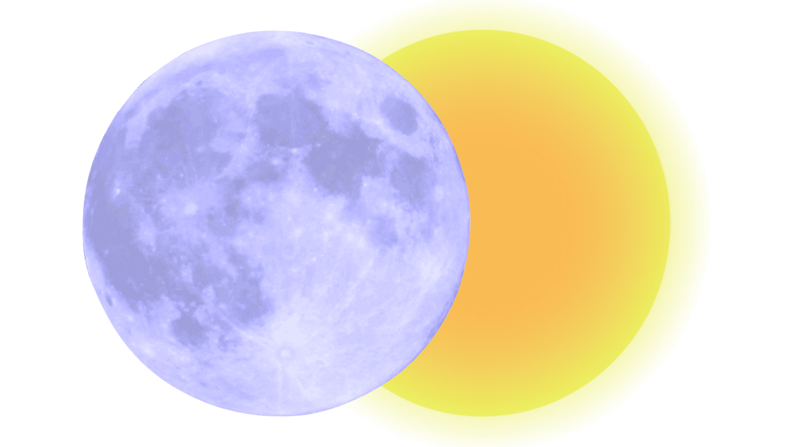

# 🌙 MoodSleep Tracker



Uma aplicação web intuitiva e acolhedora para monitorar seus hábitos de sono e humor diário, desenvolvida como projeto individual do curso de Desenvolvimento de Sistemas do SENAI Valinhos.

## 📋 Sobre o Projeto

O **MoodSleep Tracker** é uma ferramenta de bem-estar pessoal que permite aos usuários:

- 📊 **Registrar humor diário** - Escolha entre 5 estados emocionais (irritado, triste, neutro, feliz, muito feliz)
- 😴 **Monitorar padrões de sono** - Registre horas dormidas e acompanhe sua qualidade de descanso
- 📝 **Fazer anotações pessoais** - Adicione observações sobre seu dia
- 📈 **Visualizar histórico** - Acompanhe sua evolução ao longo do tempo
- 🔍 **Filtrar registros** - Analise dados por período, humor ou qualidade do sono
- 📊 **Ver estatísticas** - Obtenha insights sobre seus padrões de bem-estar

## 🚀 Tecnologias Utilizadas

- **[Next.js 15.5.3](https://nextjs.org/)** - Framework React para aplicações web modernas
- **[React 19.1.0](https://react.dev/)** - Biblioteca JavaScript para interfaces de usuário
- **[TailwindCSS 4](https://tailwindcss.com/)** - Framework CSS utility-first
- **CSS Modules** - Estilização componentizada e isolada
- **ESLint** - Linting e padronização de código

## 🎨 Design e Interface

- **Paleta de cores harmoniosa** com tons de roxo (#AEA2FC), amarelo (#FFD700) e pastéis
- **Elementos decorativos** com imagens de sol e lua para criar atmosfera acolhedora
- **Design responsivo** que funciona em diferentes dispositivos
- **Interface intuitiva** com navegação clara e componentes acessíveis

## 📁 Estrutura do Projeto

```
moodsleep-front/
├── public/
│   ├── icons/
│   │   └── moodsleep-icon.png      # Logo da aplicação
│   └── images/
│       ├── eu.jpeg                 # Foto da desenvolvedora
│       ├── lua-cheia.png          # Elemento decorativo (lua)
│       └── sol.png                # Elemento decorativo (sol)
├── src/
│   └── app/
│       ├── components/
│       │   ├── Header/             # Cabeçalho para páginas públicas
│       │   ├── Footer/             # Rodapé da aplicação
│       │   └── HeaderDashboard.*   # Cabeçalho para área logada
│       ├── cadastro/               # Página de registro
│       ├── dashboard/              # Painel principal (área logada)
│       ├── login/                  # Página de autenticação
│       ├── meus-registros/         # Histórico de registros
│       │   └── [id]/              # Detalhes de registro específico
│       ├── sobre-mim/             # Página sobre a desenvolvedora
│       ├── globals.css            # Estilos globais
│       ├── layout.jsx             # Layout base da aplicação
│       └── page.jsx               # Página inicial
├── eslint.config.mjs              # Configuração do ESLint
├── jsconfig.json                  # Configuração do JavaScript/aliases
├── next.config.mjs                # Configuração do Next.js
├── package.json                   # Dependências e scripts
└── postcss.config.mjs             # Configuração do PostCSS
```

## 🔧 Funcionalidades Detalhadas

### 🏠 Página Inicial
- **Hero section** com call-to-action para cadastro e login
- **Cards informativos** sobre os benefícios da aplicação
- **Design atrativo** com elementos visuais (sol e lua)

### 👤 Sistema de Autenticação
- **Cadastro de usuários** com nome, email e senha
- **Login seguro** com redirecionamento para dashboard
- **Interface amigável** com mensagens claras

### 📊 Dashboard Principal
- **Saudação personalizada** baseada no horário do dia
- **Seletor de humor** com 5 opções visuais (emojis)
- **Registro de horas de sono** com validação
- **Campo para anotações** opcionais do dia
- **Salvamento local** dos dados (expansível para API)

### 📈 Meus Registros
- **Lista completa** de todos os registros anteriores
- **Filtros avançados** por:
  - Período (7, 30, 90 dias ou todos)
  - Tipo de humor
  - Qualidade do sono (pouco, ideal, muito)
- **Ordenação** por data (recente ou antigo)
- **Estatísticas em tempo real**:
  - Humor médio da semana
  - Média de horas de sono
  - Dias registrados no período
- **Cards coloridos** com codificação visual por humor
- **Link para detalhes** de cada registro

### 👩‍💻 Sobre a Desenvolvedora
- **Perfil pessoal** com foto e informações
- **Links de contato** (LinkedIn, GitHub, email)
- **Contexto do projeto** como trabalho acadêmico

## 🛠️ Instalação e Execução

### Pré-requisitos
- Node.js 18+ instalado
- npm, yarn, pnpm ou bun como gerenciador de pacotes

### Passo a passo

1. **Clone o repositório**
```bash
git clone https://github.com/F3rNnd4/moodsleep-front.git
cd moodsleep-front
```

2. **Instale as dependências**
```bash
npm install
```

3. **Execute em modo de desenvolvimento**
```bash
npm run dev
```

4. **Acesse a aplicação**
Abra [http://localhost:3000](http://localhost:3000) no seu navegador

## 🚀 Deploy

### Vercel (Recomendado)
A forma mais fácil de fazer deploy é usar a [Plataforma Vercel](https://vercel.com/new?utm_medium=default-template&filter=next.js&utm_source=create-next-app&utm_campaign=create-next-app-readme):

1. Conecte seu repositório GitHub à Vercel
2. Configure as variáveis de ambiente (se necessário)
3. Deploy automático a cada push na branch main


## 🎓 Contexto Acadêmico

Este projeto foi desenvolvido como **Projeto Individual** do curso de **Desenvolvimento de Sistemas** do **SENAI Valinhos**, demonstrando:

- **Planejamento e arquitetura** de aplicação web
- **Desenvolvimento frontend moderno** com React/Next.js
- **Design UX/UI** focado em bem-estar
- **Boas práticas** de desenvolvimento
- **Documentação técnica** completa

## 👩‍💻 Desenvolvedora

**Fernanda Alves Louro**
- 🎓 Estudante de Desenvolvimento de Sistemas - SENAI Valinhos
- 💼 [LinkedIn](https://www.linkedin.com/in/fernanda-alves-louro-386966320)
- 🐙 [GitHub](https://github.com/F3rNnd4)
- 📧 [Email](mailto:fernanda.louro@aluno.senai.br)

## 📄 Licença

Este projeto foi desenvolvido para fins educacionais como parte do curso de Desenvolvimento de Sistemas.

---

💜 **MoodSleep Tracker** - *Equilibre seu sono e suas emoções* 🌙
